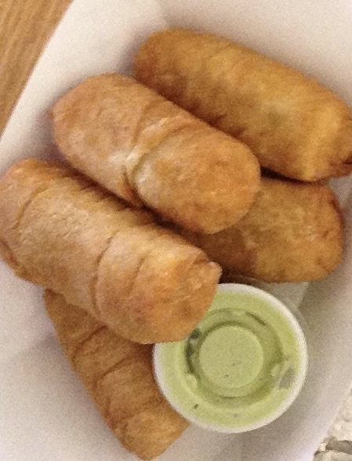

|Essie_Ella|[Reviews](readme.md)|[Recipes](page2.html)|

# My Blog
<article>
## Union Market

* 5 stars: food quality

I have never had any horribly tasting food there. The empanadas that I had in Union Market were scrumptious.

* 2 stars: affordability

The price is steep. 10 dollars for three empanadas is pricey. Even their vending machine products were expensive. A small jar of cookie butter found in a vending machine was five dollars!

* 5 stars: appearance

The place inside is beautiful and is artfully designed. The surrounding area is sketchy, though the facade of the building itself is modern and inviting.
[Union Market](https://unionmarketdc.com)

</article>
---
<article>
## IKEA Sleepovers

IKEA sleepovers are a new dare campaign, where customers stay over at IKEA. It seems really neat, however it is illegal for a person to stay overnight in a locked store. According to an Ikea UK spokesperson: "We appreciate that people are interested in Ikea and want to create fun experiences, however the safety and security of our co-workers and customers is our highest priority and that's why we do not allow sleepovers in our stores." There are some legal store run sleepovers that I am researching. I would just love to stay in the one below. But, I don't think the sleepovers work like that.

Credits: IKEA Website
</article>
